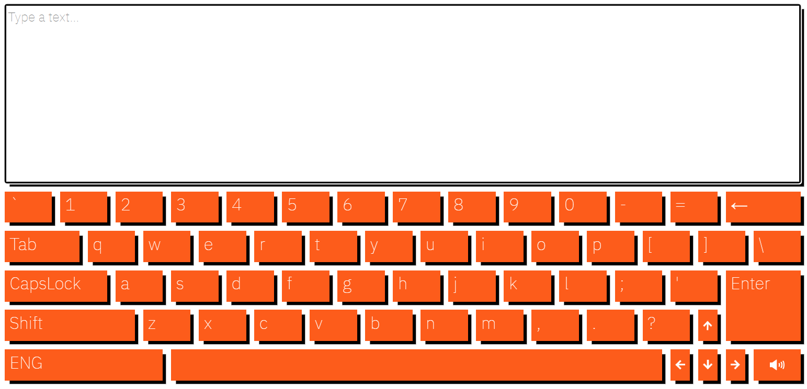

# Virtual Keyboard

## Deploy link:
https://dmitrii-snitkin.github.io/virtual-keyboard/

## Technologies used
* HTML;
* CSS (including transitions, adaptive/responsive approach);
* JavaScript (including object-oriented programming, manipulating with DOM objects).

## Description
Virtual keyboard is nothing more than just an orange keyboard wherewith you can type a text to the textarea above the keyboard. You don't need a real keyboad anymore! This one can make annoying sounds which you are able to turn off. There are two keyboard layouts: Russian and English.

Virtual keyboard is an object with all the methods implemented to imitate a real keyboard. Textarea is an integral part of the keyboard. Following methods of the object are implemented:

* `addChar` adds a character from the textarea;
* `deleteChar`deletes character 
* `changeCapsLock` toggles capslock state;
* `linguaChange` changes keyboard layout from Russian to English and vice versa;
* `toLeft` changes current position one character left;
* `toRight` changes current position one character right;
* `getLineNumber` returns the line number of the current position;
* `getPositionInLine` returns 0-based offset of starting from the current line beginning;
* `toUp` and `toDown` change current position to the corresponding offset in the previous or next line respectively; if Shift key is pressed text is selected.
